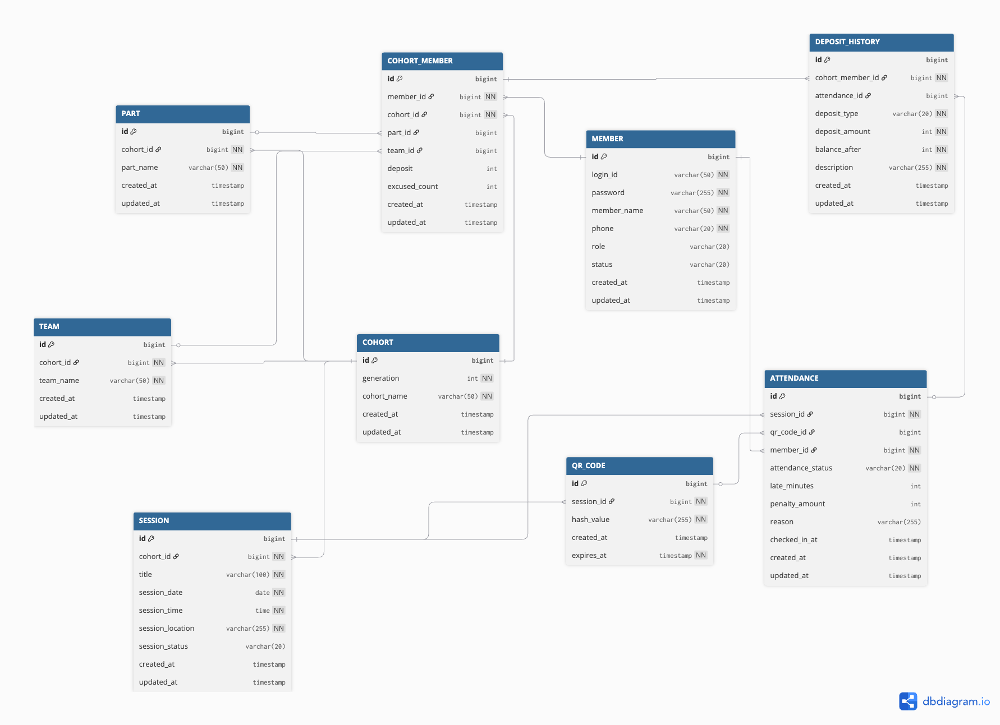

# prography-11th-backend
prography 11th backend assignment

## 실행 방법

### 요구 사항
- Java 21
- Gradle Wrapper

### 다운로드 후
프로젝트를 다운로드(클론)한 뒤, 루트 프로젝트(`prography-11th-backend`)로 이동합니다.

```bash
cd prography-11th-backend
```

### 실행
루트 프로젝트에서 아래 명령어를 실행하면 바로 서버가 실행됩니다.

```bash
./gradlew :module-api:bootRun
```

### 확인
- API Base URL: `http://localhost:8080/api/v1`
- H2 Console: `http://localhost:8080/api/v1/h2-console`

## 프로젝트 패키지 아키텍처

멀티 모듈 구조로 책임을 분리했습니다.

```text
prography-11th-backend
├── module-api
│   └── com.longrunpc.api
│       ├── admin/{attendance, cohort, member, session}
│       ├── user/{attendance, member, session}
│       ├── config
│       └── AttendanceApplication
├── module-domain
│   └── com.longrunpc.domain
│       ├── {attendance, cohort, member, session}
│       │   ├── entity
│       │   ├── repository
│       │   └── vo
│       └── config
└── module-common
    └── com.longrunpc.common
        ├── constant
        ├── error
        ├── exception
        └── response
```

- `module-api`: 컨트롤러, 요청/응답 DTO, 유스케이스 등 애플리케이션 진입점
- `module-domain`: 도메인 엔티티/VO, 레포지토리, 도메인 규칙
- `module-common`: 공통 응답 포맷, 예외/에러코드, 상수
- 의존 방향: `module-api -> module-domain`, `module-api -> module-common`


## ERD



## 회고

[회고 문서](./docs/RETROSPECTIVE.md)

## API 구현 현황
| 분류 | 목표 개수 | 구현 상태 |
| :--- | :---: | :---: |
| 필수 API | 16개 | 완료 (100%) |
| 가산점 API | 9개 | 완료 (100%) |


## API 명세

[API 명세](https://github.com/prography/11th-assignment-be-api-spec/tree/main?tab=readme-ov-file)