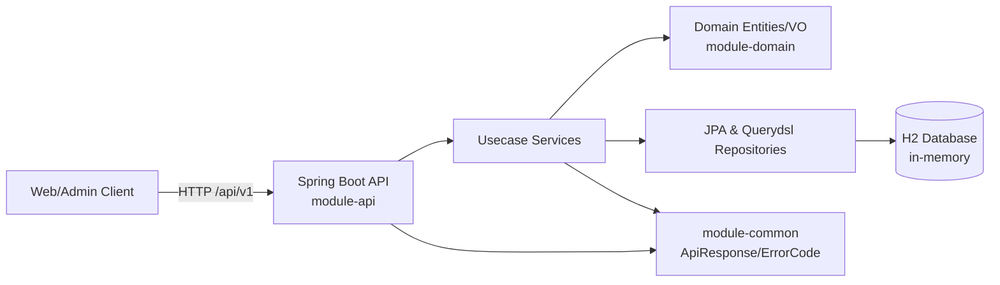
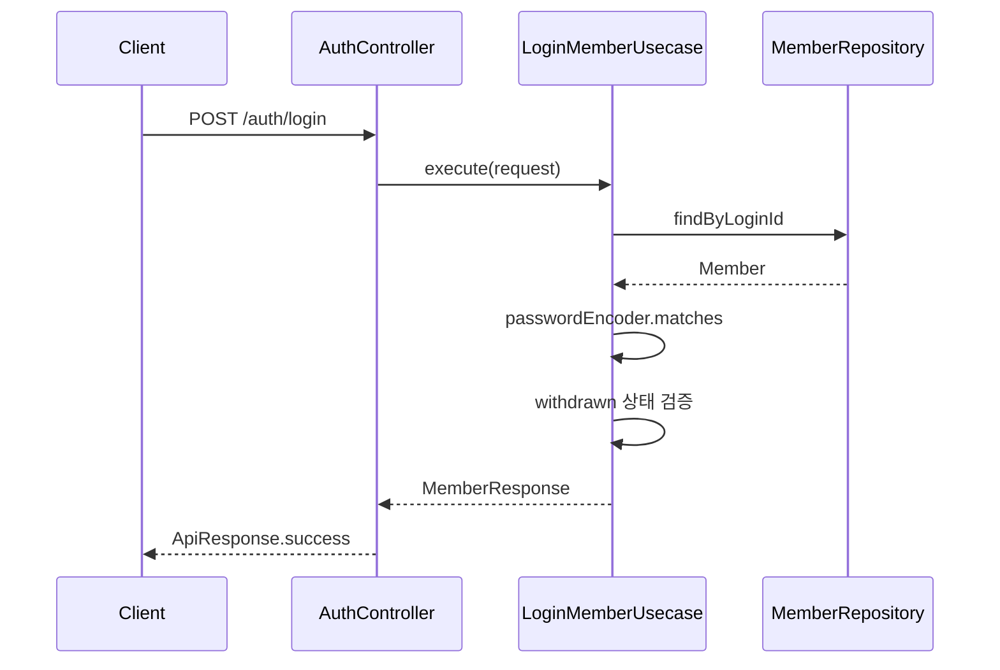
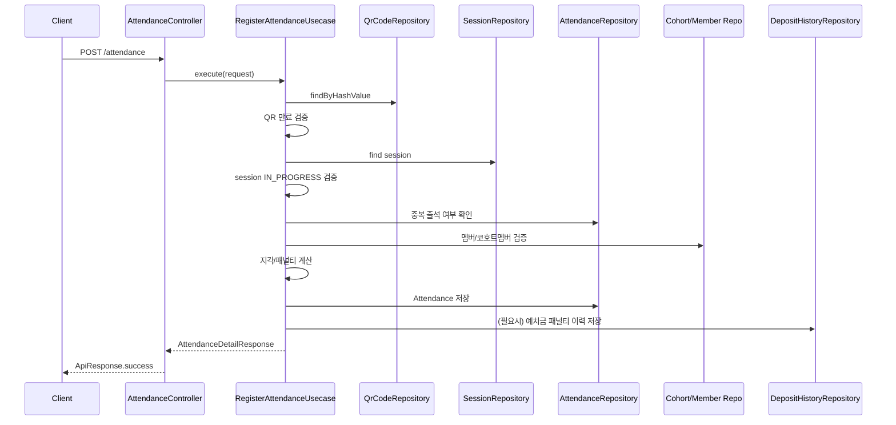
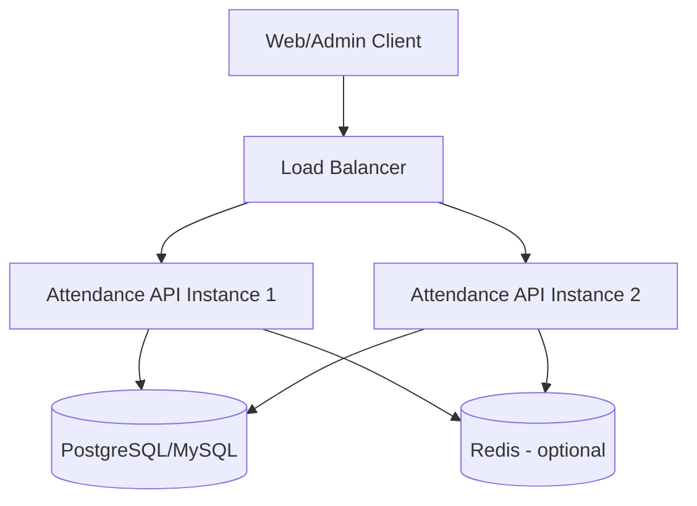

# System Design Architecture

## 1. Overview

- Project: `prography-11th-backend`
- Domain: Prography 출석/세션/코호트 운영 백엔드
- Runtime: Java 21, Spring Boot 3.3.5
- Architecture style: 멀티모듈 + 계층형(Controller -> Usecase(Service) -> Domain/Repository)

## 2. Module Architecture

```text
root
├── module-api      # API 진입점, 컨트롤러/DTO/유스케이스/설정
├── module-domain   # 핵심 도메인 모델, JPA 엔티티/VO/리포지토리
└── module-common   # 공통 응답, 예외, 에러코드, 상수
```

의존 방향:

```text
module-api --> module-domain --> module-common
module-api --> module-common
```

- `module-api`는 `@SpringBootApplication(scanBasePackages = "com.longrunpc")`로 전체 빈을 조립한다.
- `module-domain`은 `@EnableJpaRepositories(basePackages = "com.longrunpc.domain")`로 데이터 접근 계층을 제공한다.
- `module-common`은 오류 처리/응답 포맷의 단일 표준을 제공한다.

## 3. Runtime Component Diagram



## 4. Bounded Contexts / Aggregates

핵심 도메인 컨텍스트:

- Member
  - 엔티티: `Member`
  - 속성: `loginId`, `password`, `memberName`, `phone`, `role`, `status`
- Cohort
  - 엔티티: `Cohort`, `Part`, `Team`, `CohortMember`, `DepositHistory`
  - 코호트 단위 운영(기수, 팀/파트, 예치금/변동 이력)
- Session
  - 엔티티: `Session`, `QrCode`
  - 세션 상태(`SCHEDULED`, `IN_PROGRESS`, `COMPLETED`, `CANCELLED`) 및 QR 만료 제어
- Attendance
  - 엔티티: `Attendance`
  - 출석 상태(`PRESENT`, `LATE`, `ABSENT`, `EXCUSED`), 지각 분/패널티 계산

## 5. Data Architecture

주요 테이블:

- `MEMBER`
- `COHORT`, `PART`, `TEAM`, `COHORT_MEMBER`, `DEPOSIT_HISTORY`
- `SESSION`, `QR_CODE`
- `ATTENDANCE`

핵심 제약:

- `MEMBER.login_id` 유니크
- `COHORT.generation` 유니크
- `COHORT_MEMBER(member_id, cohort_id)` 유니크
- `ATTENDANCE(session_id, member_id)` 유니크 (중복 출석 방지)
- `QR_CODE.hash_value` 유니크

관계 요약:

- Cohort 1:N Part, Team, Session, CohortMember
- Member 1:N CohortMember, Attendance
- Session 1:N QrCode, Attendance
- CohortMember 1:N DepositHistory

## 6. Request Processing Flow

### 6.1 로그인



### 6.2 사용자 QR 출석



### 6.3 관리자 QR 발급/재발급

- 발급: `CreateQrCodeUsecase`
  - 세션 존재 확인
  - 동일 세션 활성 QR 존재 시 발급 차단
  - 새 QR 생성(만료시간 = 현재 + 상수 시간)
- 재발급: `ReissueQrCodeUsecase`
  - 기존 QR 즉시 만료 처리
  - 동일 세션 기준 새 QR 생성

## 7. Cross-Cutting Concerns

- Transaction
  - 유스케이스 단위 `@Transactional` 적용
  - 읽기 전용 조회는 `@Transactional(readOnly = true)` 사용
- Error handling
  - `BusinessException` + 도메인별 `ErrorCode`
  - `GlobalExceptionHandler`에서 `ApiResponse.error`로 표준화
- Validation
  - 컨트롤러 `@Valid` + DTO 검증
  - VO 생성/도메인 메서드에서 규칙 재검증
- API Docs
  - Springdoc OpenAPI (`/api/v1/swagger-ui.html`)

## 8. Security Model (Current)

현재 보안 설정:

- CSRF 비활성화
- `anyRequest().permitAll()` (인증/인가 미적용)
- 비밀번호는 BCrypt 해시 저장/검증

의미:

- 학습/과제용 로컬 실행에는 단순하고 빠르지만,
- 운영 환경에서는 인증 토큰(JWT/Session), RBAC, 관리자/사용자 권한 분리가 필요하다.

## 9. Seed / Initialization

`SeedDataInitializer`에서 애플리케이션 시작 시:

- 코호트(10기/11기) 생성
- 파트/팀 기본 데이터 생성
- admin 계정 생성 (`admin/admin1234`, BCrypt 저장)
- admin 코호트 멤버 생성 및 초기 예치금 이력 생성

## 10. Scalability & Evolution Guide

현재 구조는 단일 애플리케이션(모놀리식)으로 적절하며, 확장 시 다음 순서 권장:

1. 인증/인가 계층 도입
2. H2 -> 운영 RDB(PostgreSQL/MySQL) 전환
3. 읽기 부하 높은 집계 API에 Querydsl 최적화/인덱스 설계
4. QR 검증/출석 처리에 캐시(예: Redis) 적용 검토
5. 필요 시 `attendance`, `session`, `member` 컨텍스트 기준 모듈 분리(또는 서비스 분리)

## 11. Deployment View (Recommended)



- 현재 저장소는 인메모리 H2이므로 재시작 시 데이터가 초기화된다.
- 운영 배포에서는 외부 영속 DB를 필수로 사용해야 한다.

---

작성 기준 코드:

- `module-api`의 controller/usecase/config
- `module-domain`의 entity/repository/vo
- `module-common`의 exception/response/error
- `module-api/src/main/resources/schema.sql`, `application.yml`
